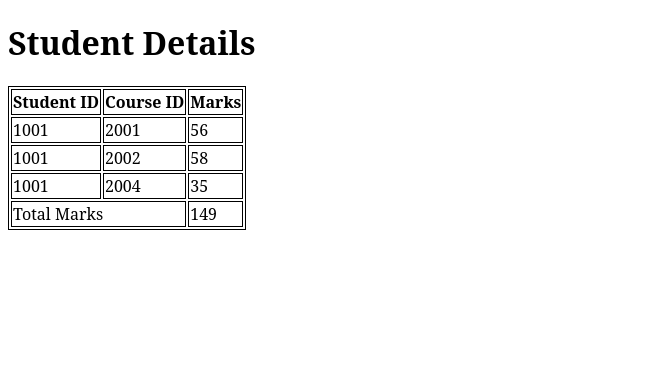
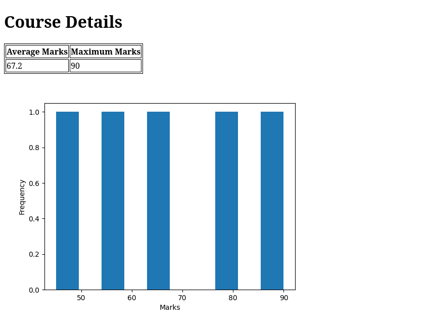

This is my submission for the Week-3 Project for the MAD-1 course of the IIT Madras BS in Data Science & Applications Online degree.

## Installing dependencies
### For Nix/NixOS Users
Please ensure that flakes are enabled on your system for the nix dev shell to work.
Simply run the following command, it will automatically initialise the `.venv` folder and install all packages (if not already present).
```bash
nix develop
```

### For other operating systems
Create a virtual environment and install all necessary packages as follows
```bash
python3 -m venv .venv
source .venv/bin/activate
pip3 install -r requirements.txt
```

## Running the program
### Viewing student data
Student data can be viewed by running the following command
```bash
python3 app.py -s [student_id]
```
This will generate the appropriate `output.html` file

### Viewing course data
Course details can be viewed by running the following command
```bash
python3 app.py -c [course_id]
```
This will generate an `output.html` file, along with a `graph.png` which contains a histogram of marks details of that course

## Screenshots
### Student Data Page


### Course Data Page


### Error Page

